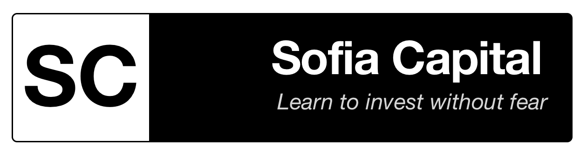

# Sofia Capital

**An Open Educational Resources and Open Knowledge project focused on finance**

---

## 📖 What is Sofia Capital?

**Sofia Capital** is an Open Educational Resources (OER) and Open Knowledge project dedicated to demystifying the world of finance. Its mission is to combat financial misinformation and empower individuals with the knowledge they need to make informed investment decisions.

### My Mission

This project was born with a clear purpose: to combat charlatans and false investment professionals who, taking advantage of the widespread lack of financial education, mislead people and prevent them from building a stable and prosperous economic life.

Sofia Capital does not claim to be a professional voice, but rather a transparent and honest one. In a world full of misleading advice, my goal is to share accessible, well-intentioned knowledge that empowers everyday people.

### Transparency First

I want to be completely transparent: I am not a financial analyst, I did not study economics, and I do not offer professional advice. Everything shared here comes from books, courses, and self-study. Like anyone, I can make mistakes — so if you see something unclear or poorly formulated, I invite you to correct me.

**Sofia Capital is not a course, nor does it pretend to be one.** It’s a compilation of personal notes and materials I felt the need to share. If this content helps you better understand finance, question unrealistic promises, and make more informed decisions, then the project fulfills its purpose.

---

## 📚 Project Structure

> **Note:** The project is currently under development and not yet finalized, so the structure may change.

This repository contains the content and configuration for the Sofia Capital Hugo website. The project is organized into educational modules:

### Module 1: Foundations
- Master your personal finances
- Rules of the Game
- Market Perspectives
- Sectors, Markets, and Hours
- Financial Instruments
- Tools and Vocabulary

### Module 2: Platform Guide
- Interactive Brokers (IBKR) platform overview
- How to open and close positions
- Currency exchange
- Stock lending

### Module 3: Quick Analysis
- MVP philosophy applied to financial analysis
- ROIBD concept (Return On Invested Brain Damage)
- Practical case studies (Alphabet, Inditex)

### Additional Content
- Blog articles
- Contribution guidelines
- Multilingual support (English & Spanish)

---

## 🌐 Website

Visit the live website: **[sofiacapital.org](https://sofiacapital.org)**

---

## 🛠️ Technology Stack

- **Static Site Generator**: [Hugo](https://gohugo.io) - [Hextra Theme](https://github.com/imfing/hextra)
- **Content Format**: Markdown
- **Languages**: English & Spanish (i18n support)
- **Deployment**: Firebase

---

## 🤝 Contributing

**This project needs you!** I currently manage this ambitious project on my own, so if you also see the usefulness of content like this, I wholeheartedly ask for your help.

### How can you help?

There are many ways to contribute to the project:

- 📢 **Sharing** the project with your close circle
- ✏️ **Correcting or editing** existing content
- 🌍 **Translating** content to other languages
- 🎨 **Contributing** graphic design ideas or materials for future campaigns
- 💰 **Making a donation** (even a small one!)

### Contribution Guidelines

I'm currently looking for an accessible and comfortable way for everyone to contribute, since making Forks and Pull Requests through GitHub is not a viable option for everyone.

---

## 📝 License

This project is licensed under the [Creative Commons Attribution 4.0 International License](LICENSE) (CC BY 4.0). This means you are free to:

- **Share** — copy and redistribute the material in any medium or format
- **Adapt** — remix, transform, and build upon the material for any purpose, even commercially

Under the following terms:

- **Attribution** — You must give appropriate credit, provide a link to the license, and indicate if changes were made

See the [LICENSE](LICENSE) file for the full legal text.

---

## ⚠️ Disclaimer

**Important**: This project provides educational content only. It does not constitute financial advice. Always consult with qualified financial professionals before making investment decisions. The author is not a licensed financial advisor and assumes no responsibility for any financial losses or decisions made based on this content.

---

## 📧 Contact

For questions, suggestions, or contributions, please write an email to: info.sofia.capital@gmail.com

---

**Made with ❤️ for financial education**

*Help us combat financial misinformation and empower individuals with knowledge*

